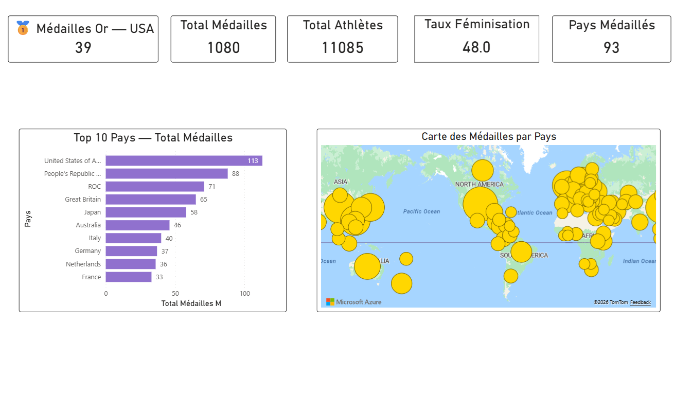
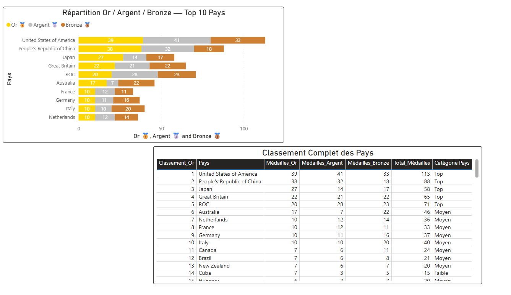
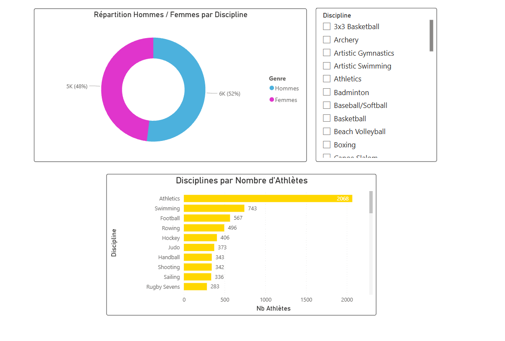

# 🏅 Tokyo 2021 Olympics Dashboard — Power BI

## 📌 Description
Interactive Power BI dashboard analyzing Tokyo 2021 
Olympics data including athletes, medals, and gender parity.
Built as part of an academic Business Intelligence project.

## 📊 Live Dashboard
[View on Power BI Service](https://app.powerbi.com/groups/me/reports/09cdd3f4-dce7-4f2d-bfbc-70f5da616ff6?ctid=604f1a96-cbe8-43f8-abbf-f8eaf5d85730&pbi_source=linkShare&bookmarkGuid=9abbc0ef-3afc-4541-a90b-1ec9d0720326)

## 📁 Repository Structure
PowerBI-Tokyo-Olympics-2021/
│
├── data/
│   ├── Athletes.xlsx
│   ├── Coaches.xlsx
│   ├── EntriesGender.xlsx
│   ├── Medals.xlsx
│   └── Teams.xlsx
│
├── Visualisations/
│   ├── vue_generale.png
│   ├── analyse_medailles.png
│   └── analyse_athletes.png
│
├── Projet1_JO_Tokyo.pbix
├── rapport_powerbi_JO_Tokyo.pdf
└── README.md

## 📄 Report
The full project report is available here:
[📥 Download Report](rapport_powerbi_JO_Tokyo.pdf)

## 🛠️ Tools Used
- Power BI Desktop
- Power Query (ETL & Data Cleaning)
- DAX (Data Analysis Expressions)
- Power BI Service (Publishing)
## 📁 Dataset
- Athletes.xlsx — 11,085 athletes
- Medals.xlsx — 93 countries
- EntriesGender.xlsx — Gender participation
- Teams.xlsx — 743 teams
- Coaches.xlsx — 394 coaches

## 🛠️ Tools Used
- Power BI Desktop
- Power Query (ETL)
- DAX (Data Analysis Expressions)

## 📸 Visualisations
### Page 1 — Vue Générale

### Page 2 — Analyse Médailles

### Page 3 — Analyse Athlètes

## 🔑 Key Insights
- 🥇 USA leads with 113 total medals
- 🏃 Athletics is the most participated sport (2,068 athletes)
- ⚖️ Near gender parity achieved: 48% female athletes
- 🌍 93 countries won at least one medal

## 👩‍💻 Author
**Souissi Oumaima**
4th-year Computer Engineering Student — Data Science & AI
[LinkedIn](https://www.linkedin.com/in/oumaima-souissi-299633242/) | [GitHub](https://github.com/SouissiOumaima)